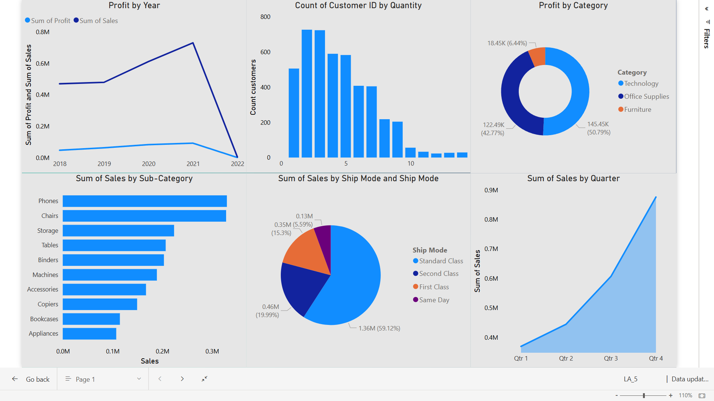

# 📊 Superstore Sales Analysis Dashboard (Power BI)

## 📌 Project Overview
This Power BI dashboard presents an interactive sales analysis using the Sample Superstore dataset. It provides business insights on sales, profit, customer behavior, and product performance across different time periods, categories, and regions.

## 🛠️ Tools Used
- Power BI Desktop
- Excel (for cleaning the dataset)
- Dataset: Sample Superstore (available online)

## 📊 Key Insights & Visuals

- **Profit by Year**  
  Trend showing total profit and sales from 2018 to 2022.

- **Customer Order Distribution**  
  Histogram of quantity per customer.

- **Profit by Category**  
  Donut chart showing Technology as the top profit-making category.

- **Sales by Sub-Category**  
  Phones and Chairs are the highest selling products.

- **Sales by Ship Mode**  
  Majority of sales use Standard Class and Second Class.

- **Sales by Quarter**  
  Strong upward trend, peaking in Q4.

## 🖼️ Dashboard Preview

## 📂 Files

- `superstore_analysis.pbix`: Power BI report file
- `Dataset/superstore_data.csv`: Dataset used
- `Screenshot/superstore_dashboard.png`: Dashboard image used in README preview

## 👨‍💻 Author
**Hemant Mahajan**  
MSc Data Science 
📫 [LinkedIn](www.linkedin.com/in/hemant-mahajan-3648642a0) | ✉️ hemantmahajan1611@gmail.com
